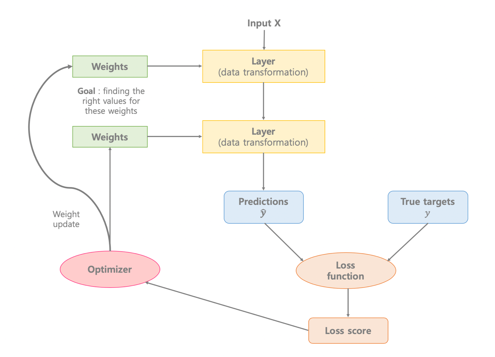
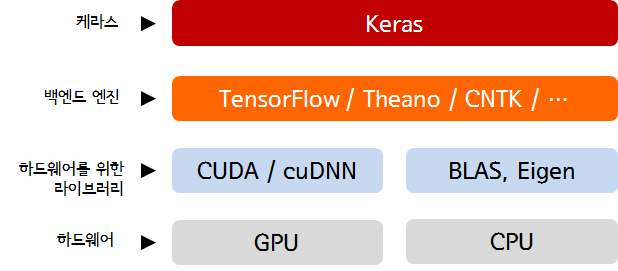

# Chap03- 신경망 시작하기

## 3.1 신경망의 구조

신경망 훈련에는 다음 요소들이 관련되어 있다.

* **네트워크(또는 모델)**를 구성하는 **층**
* **입력 데이터**와 그에 상응하는 **타깃**
* 학습에 사용할 피드백 신호를 정의하는 **손실 함수**
* 학습 진행 방식을 결정하는 **옵티마이저**



<br />

### 3.1.1 층: 딥러닝의 구성 단위

---

* **층(Layer)**은 하나 이상의 텐서를 입력으로 받아 하나 이상의 텐서를 출력하는 데이터 처리 모듈이다.
* 대부분의 층은 **가중치**라는 상태를 가진다.  
  가중치란 확률적 경사 하강법에 의해 학습되는 하나 이상의 텐서이며, 네트워크가 학습한 **지식**이 담겨 있다.
* 층마다 적절한 텐서 포맷과 데이터 처리 방식이 다르다.
  * 2D 텐서$$(samples, features)$$의 벡터 데이터 → **완전 연결 층**(*fully connected layer*) 혹은 **밀집 층**(*dense layer*)
  * 3D 텐서$$(samples, timesteps, features)$$의 시퀀스 데이터 → **순환 층**(*recurrent layer*) ex) **LSTM**
  * 4D 텐서의 이미지 데이터 → 2D **합성곱 층**(*convolution layer*)
* 케라스에서는 호환 가능한 층들을 엮어 데이터 변환 파이프라인을 구성함으로써 딥러닝 모델을 만든다.
  * **층 호환성** = 각 층이 특정 크기의 입력 텐서만 받고 특정 크기의 출력 텐서를 반환한다.

```python
from keras import models
from keras import layers

model = models.Sequential()
# 첫 번째 차원이 784인 2D 텐서만 입력으로 받는 층, 첫 번째 차원의 크기가 32로 변환된 텐서를 출력.
model.add(layers.Dense(32, input_shape=(784,)))
# 케라스에서는 모델에 추가된 층을 자동으로 상위 층의 크기에 맞추어 줌.
model.add(layers.Dense(10))
```

<br />

### 3.1.2 모델: 층의 네트워크

---

* 딥러닝 모델은 층으로 만든 비순환 유향 그래프(*Directed Acyclic Graph, DAG*)이다.  
  비순환 유향 그래프는 edge에 방향이 있고 한 node에서 다시 자기 자신으로 돌아올 경로가 없는 그래프이다.
* 네트워크 구조는 **가설 공간**(*hypothesis space*)을 정의한다.
* 네트워크 구조를 선택함으로써 **가능성 있는 공간**(가설 공간)을 입력 데이터에서 출력 데이터로 매핑하는 일련의 특정 텐서 연산으로 제한하게 된다.
* 이를 통해서 찾아야 하는 것은 이런 텐서 연산에 포함된 가중치 텐서의 좋은 값이다.

<br />

### 3.1.3 손실 함수와 옵티마이저: 학습 과정을 조절하는 열쇠

---

* 네트워크 구조를 정의하고 나면 두 가지를 더 선택해야 한다.
  * **손실 함수**(*loss function*)(**목적 함수**(*objective function*)): 훈련하는 동한 최소화 될 값, 주어진 문제에 대한 성공 지표
  * **옵티마이저**(*optimizer*): 손실 함수를 기반으로 네트워크가 어떻게 업데이트될지 결정, 특정 종류의 확률적 경사 하강법을 구현
* 여러 개의 출력을 내는 신경망은 여러 개의 손실 함수를 가질 수 있다.(출력당 하나씩)
  * `complie`메서드의 `loss` 매개변수에 손실 함수의 리스트 또는 딕셔너리를 전달.
  * 하지만 경사 하강법 과정은 하나의 스칼라 손실 값을 기준으로 하기 때문에, 손실이 여러 개인 네트워크게이서는 모든 손실이 (평균을 내서) 하나의 스칼라 양으로 합쳐진다.
* 네트워크가 손실을 최소화하기 위해 편법을 사용할 수 있기 때문에, 문제에 맞는 올바른 손실 함수를 선택하는 것은 매우 중요하다.
  * 우리가 만든 신경망은 오로지 손실 함수를 최소화하기만 한다 → **원하지 않는 방향**으로 최소화 될 수 있다
  * 분류, 회귀, 시퀀스 예측 같은 일반적인 문제에서는 간단한 지침이 있다.
    1. 2개 클래스가 있는 분류 문제 → 이진 크로스엔트로피(*binary crossentropy*)
    2. 여러 개 클래스가 있는 분류 문제 → 범주형 크로스엔트로피(*categorical crossentropy*)
    3. 회귀 문제 → 평균 제곱 오차
    4. 시퀀스 학습 문제 → CTC(*Connection Temporal Classification*)

<br />

## 3.2 케라스 소개

* 케라스는 거의 모든 종류의 딥러닝 모델을 간편하게 만들고 훈련시킬 수 있는 파이썬을 위한 **딥러닝 프레임워크**이다.


* 케라스의 특징
  * 동일한 코드로 CPU와 GPU에서 실행 할 수 있다.
  * 사용하기 쉬운 API를 가지고 있어 딥러닝 모델의 프로토타입을 빠르게 만들 수 있다.
  * (컴퓨터 비전을 위한) CNN, (시퀀스 처리를 위한) RNN을 지원하며 이 둘을 자유롭게 조합하여 사용할 수 있다.
  * 다중 입력이나 다중 출력 모델, 층의 공유, 모델 공유 등 어떤 네트워크 구조도 만들 수 있다. 이 말은 GAN(*Generative Adversarial Network*) 부터 뉴럴 튜링 머신까지 케라스는 기본적으로 어떤 딥러닝 모델에도 적합하다는 뜻이다.

<br />

### 3.2.1 케라스, 텐서플로, 씨아노, CNTK

---

* 케라스는 텐서 조작이나, 미분 같은 저수준의 연산은 다루지 않는다.
  * 하지만 **백엔드 엔진**에서 제공하는 텐서 라이브러리를 통해서 사용 가능하다.
  * 케라스는 모듈 구조로 구성되어 여러 가지 백엔드 엔진을 자유롭게 사용할 수 있다.
  * 현재 TensorFlow, Theano, CNTK 3개의 백엔드 엔진이 존재 (기본은 TensorFlow)



* 케라스로 작성한 코드는 아무런 변경 없이 이런 백엔드 중 하나를 선택해서 실행시킬 수 있다.
  * 개발하는 중간에 하나의 백엔드가 특정 작업에 더 빠르다고 판단되면 언제든지 백엔드를 바꿀 수 있다.

<br />

### 3.2.2 케라스를 사용한 개발: 빠르게 둘러보기

---

케라스를 활용한 대부분의 작업 흐름은 다음과 같다.

1. 입력 텐서와 타깃 텐서로 이루어진 훈련 데이터를 정의한다.
2. 입력과 타깃을 매핑하는 층으로 이루어진 네트워크(또는 모델)를 정의한다.
3. 손실 함수, 옵티마이저, 모니터링하기 위한 측정 지표를 선택하여 학습 과정을 설정한다.
4. 훈련 데이터에 대해 모델의 `fit()` 메서드를 반복적으로 호출한다.

<br />

MNIST 데이터 셋을 이용한 신경망 예제를 통해서 살펴보자. 자세한 코드는 **Jupyter Notebook** 참고 → [[링크](http://nbviewer.jupyter.org/github/ExcelsiorCJH/Deep-Learning-with-Python/blob/master/Chap02-mathematical_building_blocks_of_neural_networks/Chap02-mathematical_building_blocks_of_neural_networks.ipynb#2.1.1-MNIST-%EB%B6%84%EB%A5%98%EA%B8%B0-%EA%B5%AC%ED%98%84)]

1. 입력 텐서와 타깃 텐서로 이루어진 훈련 데이터를 정의한다.

```python
from keras.datasets import mnist
(train_images, train_labels), (test_images, test_labels) = mnist.load_data()
```

2. 입력과 타깃을 매핑하는 층으로 이루어진 네트워크(또는 모델)를 정의한다.

   * 모델을 정의하는 방법은 두 가지가 있다. (Sequential 클래스, 함수형 API)
   * **Sequential** 클래스는 층을 순서대로 쌓아올린 네트워크이다. (가장 자주 사용)

   ```python
   from keras import models
   from keras import layers
   
   model = models.Sequential()
   model.add(layers.Dense(32, activation='relu', input_shape=(784,)))
   model.add(layers.Dense(10, activation='softmax'))
   ```

   * **함수형 API**는 완전히 임의의 구조를 만들 수 있는 비순환 유향 그래프(DAG)를 만든다.
   * 모델이 처리할 데이터 텐서를 만들고 마치 함수처럼 이 텐서에 층을 적용한다.

   ```python
   input_tensor = layers.Input(shape=(784,))
   x = layers.Dense(32, activation='relu')(input_tensor)
   output_tensor = layers.Dense(10, activation='softmax')(x)
   
   model = models.Model(inputs=input_tensor, outputs=output_tensor)
   ```

   * 모델 구조가 정의된 후에는 **Sequental** 모델을 사용했는지 **함수형 API**를 사용했는지는 상관없다.
   * 이 예제에서는 조밀하게 연결된 신경망 층인 **Dense** 층 2개가 연속된 모델을 사용했다.
   * 마지막 층은 10개의 확률 점수가 들어 있는 배열을 반환하고(**소프트맥스**), 이 점수는 현재 숫자 이미지가 10개의 숫자 클래스 중 하나에 속할 확률이다.

3. 손실 함수, 옵티마이저, 모니터링하기 위한 측정 지표를 선택하여 학습 과정을 설정한다.

   ```python
   model.complie(optimizer='rmsprop',
                loss='categorical_crossentropy',
                metrics=['accuracy'])
   ```

   * 여기에 쓰인 `categorical_crossentropy`는 손실 함수이고 이는 가중치 텐서를 학습하기 위한 피드백 신호로 사용되며 훈련하는 동안 최소화된다.
   * 그리고 미니 배치 확률적 경사 하강법을 통해 손실이 감소되는데. 경사 하강법을 적용하는 구체적인 방식은 첫 번째 매개변수로 전달된 `rmsprop` 옵티마이저에 의해 결정된다.

4. 훈련 데이터에 대해 모델의 `fit()` 메서드를 반복적으로 호출한다.

   ```python
   model.fit(train_images, train_labels, epochs=5, batch=128)
   ```

   * `fit()` 메서드를 호출하면 네트워크가 128개 샘플씩 미니 배치로 훈련 데이터를 다섯 번 반복한다.
   * 각 반복마다 네트워크가 배치에서 손실에 대한 가중치의 그래디언트를 계산하고, 그에 맞추어 가중치를 업데이트한다.

